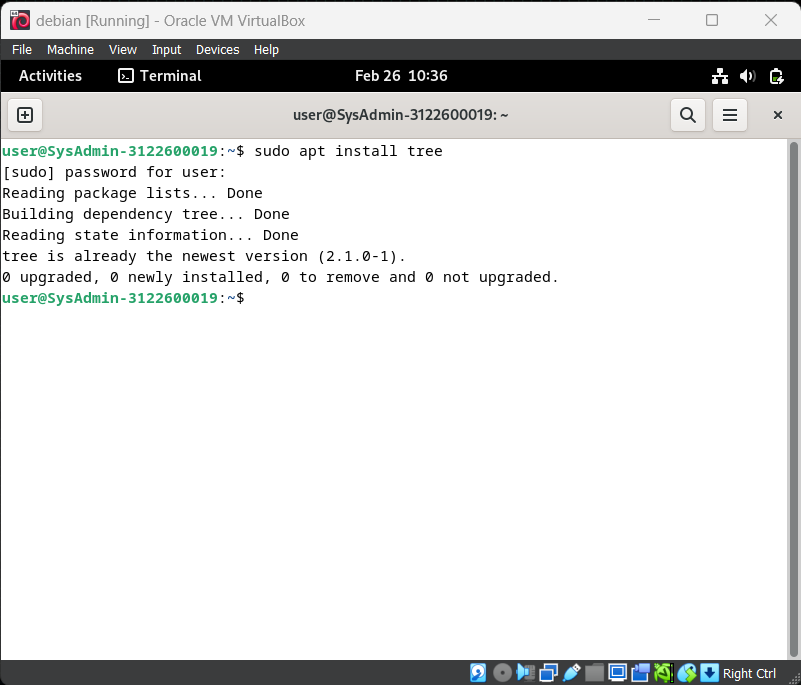

# Sudo Command
    Nama           : Saiq Syahru Qadri
    NRP            : 3122600029
    Kelas          : 2 - D4 Teknik Informatika A
    Mata Kuliah    : Administrasi Jaringan
    Dosen Pengampu : Dr. Ferry Astika Saputra ST, M.Sc

#

## Deskripsi

sudo merupakan sebuah perintah dalam command-line Linux. Apabila anda memiliki akses root, maka sudo akan melakukan perintah sebagai superuser. Pengguna sudo dan perintah-perintah yang dapat mereka pergunakan terdapat pada file konfigurasi, /etc/sudoers.

## Contoh perintah yang menggunakan sudo

Contoh 1 sudo apt install (nama yang akan di instal)

